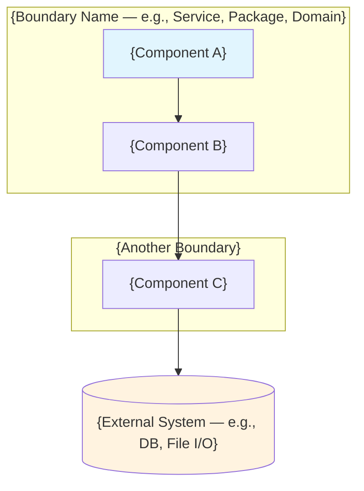
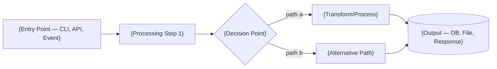

# Release Document Template

> Structure for `{feature-dir}/release.md` produced by the `/qa-review` skill.

---

## Template

Write the release document using this exact structure. Every section is mandatory — if a section
has no content (e.g., no deviations), write "None" rather than omitting the section.

```markdown
# Release Report: {Feature Name}

> {One-sentence summary: what was delivered and the overall assessment}

**Feature directory:** `docs/designs/YYYY/NNN-{feature-name}/`
**Assessment:** {PASS | PASS WITH NOTES | FAIL}
**Date:** {YYYY-MM-DD}

---

## Feature Summary

| Aspect | Value |
|--------|-------|
| **Started** | {date of first sdlc-log.md entry} |
| **Completed** | {date of this review} |
| **Tasks planned** | {N} |
| **Tasks completed** | {M} |
| **Requirements (FR)** | {met}/{total} met ({partially} partial, {not_met} not met) |
| **Requirements (NFR)** | {met}/{total} met ({partially} partial, {not_met} not met) |
| **Source files** | {N files} across {K directories} |
| **Test files** | {M files} ({unit} unit, {integration} integration, {contract} contract, {e2e} e2e, {ui} ui) |
| **Total tests** | {N tests} — {pass_count} passing, {fail_count} failing |

---

## Implementation Architecture

This section describes what was actually built — the architecture visible in the code,
not the architecture that was designed. It provides the technical context needed to understand
the requirements traceability and deviation analysis that follows.

### Code Footprint

{Organized inventory of every directory and its role in the feature. Example:}

| Directory | Role | Key Files | Lines |
|-----------|------|-----------|-------|
| `tools/demo-mcp/demo_mcp/models/` | Domain models, params, responses | 10 files | ~800 |
| `tools/demo-mcp/demo_mcp/generator/` | Synthetic data generation pipeline | 9 files | ~1200 |
| `tools/demo-mcp/demo_mcp/normalizer/` | OCSF normalization and DB loading | 15 files | ~1500 |
| `tools/demo-mcp/demo_mcp/tools/` | MCP tool handlers | 14 files | ~900 |
| `tools/demo-mcp/tests/unit/` | Unit tests | 20 files | ~2000 |
| `tools/demo-mcp/tests/integration/` | Integration tests | 3 files | ~400 |
| **Total** | | **{N} files** | **~{M} lines** |

### Architecture Summary

{3-5 sentences describing the architecture as built. What patterns does the implementation use?
How do the major components connect? What is the data flow from input to output?}

### Component & Boundary Diagram

{Mermaid diagram showing the implemented architecture — components, boundaries, and dependencies
as they exist in the code. This is NOT a copy of the HLD diagram. It is generated from reading
the actual module structure, imports, and dependencies.}



{If the implemented architecture differs from the HLD, explain specifically what changed:
"This diagram reflects the implemented architecture. Differences from the HLD: ..."}

### Feature Flow Diagram

{Mermaid flowchart or sequence diagram showing the primary data/execution flow through the
feature end-to-end. Derived from actual code traces, not the LLD design.}



{If the flow changed from what the LLD specified, explain what changed and whether it was
an improvement or a concerning drift.}

{For features with multiple distinct flows, include 2-3 diagrams for the most important flows.}

### Component Map

{Describe each major component/module — what it does, its key abstractions, and how it connects
to other components. Focus on architecture, not implementation details.}

| Component | Purpose | Key Abstractions | Dependencies |
|-----------|---------|------------------|--------------|
| {component name} | {what it does} | {main classes/protocols/interfaces} | {what it depends on} |

### Key Technical Decisions

{List significant implementation choices and assess whether they were sound.}

| Decision | Rationale | Assessment |
|----------|-----------|------------|
| {what was chosen} | {why} | {Sound / Acceptable / Concerning} |

---

## Goals Assessment

Trace each goal from README.md to its delivery status, backed by code evidence.

| # | Goal (from README.md) | Status | Code Evidence |
|---|----------------------|--------|---------------|
| 1 | {goal text} | {Achieved / Partially Achieved / Not Achieved} | {specific modules, classes, or features that deliver this goal — not just task numbers} |
| 2 | ... | ... | ... |

### Goal Alignment Summary

{2-3 sentences assessing whether the delivered implementation achieves the vision described in
README.md. Does the implementation deliver the intended business value? Is the user experience
coherent across independently implemented tasks? Reference specific architectural observations
from the code analysis.}

---

## Requirements Traceability

### Functional Requirements

| ID | Requirement | Priority | Status | Task(s) | Code Evidence | Notes |
|----|-------------|----------|--------|---------|---------------|-------|
| FR-1 | {requirement title from prd.md} | {Must/Should/Could} | {Met / Partially Met / Not Met / Descoped / Deferred} | {Task N, Task M} | {file paths, class/function names, test files with counts} | {if not fully met: why} |
| FR-2 | ... | ... | ... | ... | ... | ... |

### Non-Functional Requirements

| ID | Requirement | Target | Status | Code Evidence | Notes |
|----|-------------|--------|--------|---------------|-------|
| NFR-1 | {requirement from prd.md} | {target value} | {Met / Partially Met / Not Met} | {how the code addresses this — patterns used, configurations, test results} | {context} |
| NFR-2 | ... | ... | ... | ... | ... |

### Requirements Summary

- **Total FRs:** {N} — {met} Met, {partial} Partially Met, {not_met} Not Met, {descoped} Descoped, {deferred} Deferred
- **Total NFRs:** {N} — {met} Met, {partial} Partially Met, {not_met} Not Met
- **MoSCoW coverage:** All "Must" requirements {met/not fully met}. {N} of {M} "Should" requirements met.

---

## Code Quality Assessment

{Evaluation of the implemented code against the project's engineering principles. This is a
feature-level assessment, not a per-file review.}

| Dimension | Rating | Observations |
|-----------|--------|--------------|
| **Modularity** | {Strong / Adequate / Weak} | {Are modules cohesive with clear boundaries?} |
| **Domain Modeling** | {Strong / Adequate / Weak} | {Do types express the domain language? Are value objects immutable?} |
| **Type Safety** | {Strong / Adequate / Weak} | {Are annotations complete? Pydantic at boundaries?} |
| **Error Handling** | {Strong / Adequate / Weak} | {Are errors explicit and propagated with context?} |
| **Testability** | {Strong / Adequate / Weak} | {Is logic separated from I/O? Can units be tested in isolation?} |
| **Code Organization** | {Strong / Adequate / Weak} | {Does structure follow project conventions?} |

### Test Coverage Analysis

| Category | Count | Modules Covered | Gaps |
|----------|-------|-----------------|------|
| Unit tests | {N} | {list of tested modules} | {untested modules, if any} |
| Integration tests | {N} | {what boundaries they test} | {untested boundaries} |
| Contract tests | {N} | {what API/event contracts they validate} | {unvalidated contracts} |
| E2E tests | {N} | {what journeys they cover} | {untested paths} |
| UI tests | {N} | {what user interactions they cover} | {untested UI flows} |

### Strengths

{3-5 bullets highlighting what aspects of the implementation are particularly well-done.
Reference specific modules, patterns, or decisions.}

### Technical Debt

{List of shortcuts, TODOs, known limitations, or areas needing future attention.
Classify each as: acceptable for current scope, or needs attention before production.}

| Item | Location | Severity | Notes |
|------|----------|----------|-------|
| {description} | {file path or module} | {Low / Medium / High} | {acceptable or needs attention} |

---

## Scope Adherence

### Delivered as Planned

{Bulleted list of scope items from prd.md that were delivered as originally specified.}

### Scope Changes

| Change | Type | Reason | Impact |
|--------|------|--------|--------|
| {what changed} | {Added / Removed / Modified} | {why it changed} | {effect on delivery} |

If no scope changes occurred, write: "No scope changes. All work delivered as originally planned."

---

## Deviations from Design

Document every case where the implementation differs from the original design (LLD/HLD).
Deviations are classified by type: improvements make the code better than planned, trade-offs
are conscious compromises, and drifts are unintentional divergences.

| # | Planned (from LLD/HLD) | Actual Implementation | Type | Reason | Impact |
|---|------------------------|----------------------|------|--------|--------|
| 1 | {what the design specified} | {what was actually built — reference specific code} | {Improvement / Trade-off / Drift} | {why it changed} | {effect on system} |

Source deviations from:
- Task completion notes in tasks-breakdown.md (the "Deviations" field)
- SDLC log findings that flagged design misalignment
- Direct comparison of LLD contracts against implemented code (Step 4c)
- Review verdicts and resolution reports

If no deviations occurred, write: "Implementation matched the design exactly. No deviations."

---

## Implementation Value Assessment

{Narrative assessment of what the feature delivers from a technical perspective.
This section answers: "Beyond meeting requirements, what did we actually build and is it good?"}

### Reusability & Extensibility

{Which components could be reused in future features? How hard would it be to extend the
feature with new capabilities? Are there clear extension points?}

### Architecture Verdict

{2-3 sentences summarizing whether the implemented architecture is sound, supports the
feature's goals, and positions the codebase well for future work.}

---

## Manual Verification Guide

A practical runbook for manually verifying that the feature works correctly. Follow these
steps to confirm the feature delivers its intended value.

### Prerequisites

{Everything needed before verification can begin.}

| Requirement | Details |
|-------------|---------|
| **Environment** | {OS, Python version, runtime requirements} |
| **Dependencies** | {How to install — e.g., `uv sync --all-packages`} |
| **Configuration** | {Env vars, config files, settings needed} |
| **Data/State** | {Seed data, migrations, or preparation steps} |
| **External Services** | {Running services, API keys, network access — or "None"} |

### Setup Commands

{Exact commands to get from a clean checkout to a runnable state:}

```bash
# 1. Install dependencies
{command}

# 2. Prepare data/state (if needed)
{command}

# 3. Start services (if needed)
{command}
```

### Verification Scenarios

{For each major capability the feature delivers, a concrete scenario that proves it works.
Each scenario maps to a goal or critical FR from the design.}

#### Scenario 1: {Name — maps to Goal/FR}

| Aspect | Details |
|--------|---------|
| **Verifies** | {Which goal or FR this proves} |
| **Setup** | {Any scenario-specific preparation} |

**Steps:**

1. {Exact command or action to perform}
2. {Next command or action}
3. ...

**Expected Result:**

{What you should see — specific output, behavior, file content, or state change.
Be concrete enough that the verifier can confirm pass/fail unambiguously.}

**Verify:**

{How to confirm it worked beyond the immediate output — check DB state, inspect files,
query an endpoint, etc.}

---

#### Scenario 2: {Name — maps to Goal/FR}

{Same structure as Scenario 1. Include enough scenarios to cover all goals and Must FRs.}

---

### Error & Edge Case Verification

{2-3 scenarios that verify the feature handles errors gracefully:}

| Scenario | Input/Action | Expected Behavior |
|----------|-------------|-------------------|
| {error case description} | {what to do} | {expected error message or graceful degradation} |

### Quality Assurance Checklist

Run these checks to confirm quality standards are met:

- [ ] All tests pass: `uv run pytest {feature-test-path} -v`
- [ ] No lint errors: `uv run ruff check {feature-source-path}`
- [ ] No type errors: `uv run ty check`
- [ ] Code formatted: `uv run ruff format --check {feature-source-path}`
- [ ] No regressions in existing functionality
- [ ] Error cases handled gracefully (tried invalid inputs from scenarios above)
- [ ] Logs are structured and useful (checked log output during verification scenarios)
- [ ] Performance is acceptable (no sluggish operations observed during scenarios)
{Add feature-specific checks as needed — e.g., data validation, security checks, etc.}

---

## Lessons Learned

### What Went Well

{3-5 bullets on things that worked effectively during this feature's development. Focus on
process, tooling, design decisions, and team dynamics. Reference specific examples from the
code or process.}

### What Could Improve

{3-5 bullets on things that could be better next time. Be specific and actionable — not
"communication could be better" but "the LLD should specify index requirements explicitly
to avoid mid-implementation design changes."}

### Process Observations

{Any observations about the SDLC process itself: did the gating work? Were the task
decompositions the right size? Were there phases that felt unnecessary or insufficient
for this feature?}

---

## Risk Register Retrospective

Review the risks identified in prd.md and assess whether they materialized:

| ID | Risk (from prd.md) | Materialized? | What Happened | Mitigation Effective? |
|----|---------------------|---------------|---------------|-----------------------|
| R-1 | {risk description} | {Yes / No / Partially} | {what actually happened} | {Yes / No / N/A} |

---

## Next Steps

{Concrete actions for anything not fully delivered. Each item should be ready to become
a backlog ticket. Include items surfaced by the code quality assessment and technical debt
analysis, not just unmet requirements.}

| # | Action | Type | Priority | Rationale |
|---|--------|------|----------|-----------|
| 1 | {specific action} | {Bug / Enhancement / Tech Debt / Follow-up Feature} | {Must / Should / Could} | {why this needs to happen} |

If no next steps are needed, write: "Feature is complete. No follow-up actions required."

---

## Delivery Timeline

{Condensed chronological view extracted from sdlc-log.md showing key milestones:}

| Date | Phase | Activity | Outcome |
|------|-------|----------|---------|
| {date} | Discovery | Feature inception + requirements | {summary} |
| {date} | Design | HLD + LLD | {summary} |
| {date} | Breakdown | Task decomposition | {N tasks created} |
| {date} | Implementation | Task 1: {name} | {summary} |
| ... | ... | ... | ... |
| {date} | QA & Product Review | Release validation | {this assessment} |
```

---

## Section-by-Section Guidance

### Feature Summary

Pull dates from sdlc-log.md timestamps. Count tasks from tasks-breakdown.md. Count requirements
from prd.md. Pull code metrics from the code footprint analysis in Step 4f.

### Implementation Architecture

This is the most important new section. It should give a reader who hasn't seen the code a
clear mental model of what was built. The architecture summary should be written from the
perspective of someone who read the code, not someone who read the design docs.

The Code Footprint table should be comprehensive — every directory that the feature touches.
The Component Map should show how the pieces fit together.

#### Mermaid Diagrams

The two mermaid diagrams are critical — they communicate the architecture visually in a way
that tables and text cannot.

**Component & Boundary Diagram:** Build this from the actual import graph and module structure.
Each node is a real module or package. Subgraphs represent actual package boundaries. Edges
represent real dependencies (not hypothetical ones from the design). If the HLD had a different
boundary structure, call it out explicitly beneath the diagram.

**Feature Flow Diagram:** Build this from tracing actual execution paths in the code. Each node
is a real function, class, or module that processes data. The flow should be verifiable by
reading the code — someone should be able to follow the diagram and find the corresponding
code at each step. If the LLD specified a different flow, explain what changed.

Use appropriate mermaid diagram types:
- `graph TB` or `graph LR` for component diagrams
- `flowchart LR` or `flowchart TD` for execution flows
- `sequenceDiagram` for interaction-heavy flows between components
- Use styles to distinguish component types (domain=blue, infra=orange, external=grey, etc.)

### Manual Verification Guide

This section turns the release document into something actionable. A developer who picks up
this feature 6 months from now should be able to follow the verification guide and confirm
everything works.

**Prerequisites** should be exact — list every command needed to go from a clean checkout to
a runnable state. Don't assume the verifier knows the project.

**Verification Scenarios** should map 1:1 to goals and critical FRs. Each scenario should be
concrete enough that pass/fail is unambiguous — specific commands to run, specific output to
expect. Derive these from the demo scenarios, user journeys, or acceptance criteria in the PRD.

**Error & Edge Cases** should cover the most likely failure modes. What happens with bad input?
Missing dependencies? Corrupted data? The feature should handle these gracefully.

**QA Checklist** should use the project's actual tool commands (uv run pytest, ruff check, etc.)
with the correct paths for this feature. Add feature-specific checks beyond the standard ones.

### Goals Assessment

Map each goal from README.md to concrete code evidence. "Achieved" means the goal is fully met
by shipped code. "Partially Achieved" means the direction is right but not all aspects are
complete. Evidence should reference specific modules, classes, and features — not just task
numbers.

### Requirements Traceability

This is the core of the document. Every single FR and NFR from prd.md must appear in these
tables. The "Code Evidence" column is the key upgrade from v1 — it should reference concrete
artifacts: file paths, class names, function signatures, test files with test counts. Not
"Task 5 completed this" but "implemented in `module/handler.py::handle_request()` with 8 unit
tests in `tests/unit/test_handler.py`."

For acceptance criteria with Given/When/Then format in prd.md, evaluate each criterion
individually. A requirement is "Partially Met" if some criteria pass and others don't.

### Code Quality Assessment

Rate each dimension honestly. A feature can pass with adequate quality — "Strong" should be
reserved for genuinely well-implemented aspects. The test coverage analysis should identify
real gaps, not just confirm tests exist.

### Deviations

Be objective and factual. The new classification (Improvement / Trade-off / Drift) helps the
team understand whether deviations are healthy or concerning. Most deviations in practice are
improvements or trade-offs — drift should be rare and flagged clearly.

### Implementation Value Assessment

This section is about engineering judgment. Having read the code, what is your honest assessment
of what was built? Is it solid? Is it maintainable? Would you be comfortable extending it?
This is where the code analysis pays off — it turns the release document from a checklist into
a genuine engineering assessment.

### Lessons Learned

Draw from the full development history. The sdlc-log.md findings, task completion notes,
review verdicts, and your own code analysis all feed into this section. Focus on insights
that would change how the team approaches the next feature.

### Next Steps

Every unmet or partially met requirement should generate a Next Steps item unless it was
intentionally descoped. Additionally, items from the technical debt analysis and code quality
assessment should appear here if they need attention. Each item should be specific enough to
become a backlog ticket without additional discovery.
