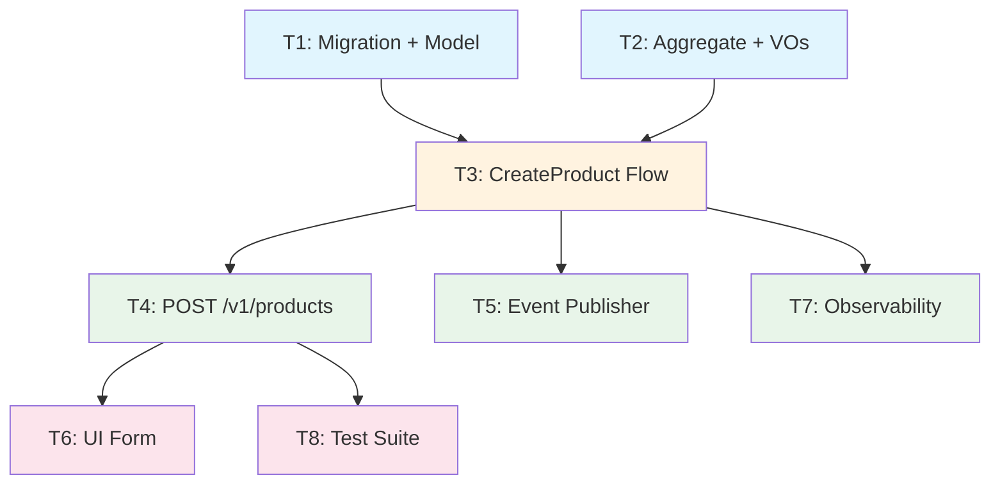

# Dependency Graph

> Techniques for mapping dependencies, identifying parallelization opportunities, and analyzing the critical path.

---

## Dependency Types

### Hard Dependencies

A task **cannot start** until its hard dependency is complete. The output of the dependency is a required input.

**Examples:**


- API route handler → depends on → domain entity definition (can't write the handler without knowing the model)
- Repository adapter → depends on → database migration (can't query a table that doesn't exist)
- Event consumer → depends on → event schema definition (can't consume without knowing the shape)
- UI component → depends on → API endpoint (can't fetch data from an endpoint that doesn't exist)

**Identifying hard dependencies:** Ask "Can I write this code if the dependency doesn't exist yet?" If the answer is no — hard dependency. If you could write it with a mock/interface — soft dependency.


### Soft Dependencies


A task is **easier** if the soft dependency is done first, but it **can proceed** using mocks, interfaces, or stubs.


**Examples:**

- Flow (use case) → soft depends on → repository adapter (can write the flow against the port/protocol, test with in-memory stub)
- UI component → soft depends on → finalized API (can build with mock data, connect later)
- Event publisher → soft depends on → message broker setup (can use in-process bus initially)

**Identifying soft dependencies:** Ask "Can I define an interface/port and code against it?" If yes — soft dependency. The implementation can be swapped in later.

---

## Building the Dependency Graph

### Step 1: List All Tasks

Write every task from the breakdown as a node:

```
T1: Product migration + persistence model
T2: Product aggregate + value objects
T3: CreateProduct flow
T4: POST /v1/products route
T5: product.created event publisher
T6: CreateProduct UI form
T7: Observability instrumentation
T8: Test suite
```

### Step 2: Draw Edges

For each task, ask: "What must exist before this can start?"

```
T1 → T3  (flow needs the persistence model to exist)
T2 → T3  (flow uses the aggregate and value objects)
T3 → T4  (route calls the flow)
T3 → T5  (event is published from the flow)
T4 → T6  (UI calls the API)
T3 → T7  (instrument the flow and its dependencies)
T4 → T8  (tests validate the route + flow + persistence)
```

### Step 3: Identify Parallelizable Pairs

Tasks with **no path between them** in the DAG can run concurrently:

```
T1 and T2 — no mutual dependency → PARALLEL
T4 and T5 — no mutual dependency → PARALLEL
T5 and T6 — no mutual dependency → PARALLEL
```

### Step 4: Assign Tiers

Topological sort, grouping tasks that can start at the same time:

```
Tier 0: [T1, T2]          ← Foundation, no dependencies
Tier 1: [T3]              ← Depends on T1 + T2
Tier 2: [T4, T5, T7]      ← Depends on T3, mutual independence
Tier 3: [T6, T8]          ← Depends on T4
```

---

## Critical Path Analysis

The **critical path** is the longest chain of hard dependencies. It determines the minimum elapsed time to complete the feature, regardless of parallelization.

### Finding the Critical Path

1. For each task, calculate its **earliest start time** = max(earliest finish of all hard dependencies)
2. For each task, calculate its **earliest finish time** = earliest start + estimated duration
3. The path with the highest total finish time is the critical path

### Example

```
T1 (M) → T3 (M) → T4 (S) → T6 (M) → total: M + M + S + M = ~7 sessions
T1 (M) → T3 (M) → T5 (S) → total: M + M + S = ~4 sessions
T2 (S) → T3 (M) → T4 (S) → T8 (M) → total: S + M + S + M = ~5 sessions
```

Critical path: **T1 → T3 → T4 → T6** (longest chain, ~7 sessions)

### Why It Matters

- The critical path cannot be shortened by adding parallelism — only by reducing task scope on the path
- Tasks NOT on the critical path have **slack** — they can start later without delaying the feature
- If you need to cut scope, prefer cutting from non-critical-path tasks
- If you need to accelerate, focus on reducing complexity of critical-path tasks

---

## Parallelization Strategies

### Strategy 1: Tier-Based Parallelization

The simplest approach. Tasks in the same tier run concurrently.

```
Time →
        ┌──────┐  ┌──────┐
Tier 0: │  T1  │  │  T2  │     (parallel)
        └──┬───┘  └──┬───┘
           └────┬─────┘
                ▼
        ┌──────────┐
Tier 1: │    T3    │            (sequential — depends on both)
        └────┬─────┘
             │
        ┌────┼────────┐
        ▼    ▼        ▼
Tier 2: T4   T5       T7       (parallel)
        │
        ▼
Tier 3: T6   T8                (parallel)
```

**Best for:** Feature breakdowns with clear tiers. Assign one subagent per task per tier.

### Strategy 2: Interface-First Parallelization

Define all interfaces (ports, contracts, types) first, then implement against them in parallel.

```
Phase 1: Define ports, request/response models, event schemas  (1 task)
Phase 2: Implement all adapters in parallel                     (N tasks)
```

This converts hard dependencies into soft dependencies by extracting the interface definition as a prerequisite.

**Best for:** Features where many tasks depend on the same abstractions.

### Strategy 3: Walking Skeleton + Flesh

Build one thin end-to-end path first, then parallelize remaining slices.

```
Phase 1: Task 1 (walking skeleton — full vertical slice)

Phase 2: Tasks 2, 3, 4 in parallel (each adds a capability on top of skeleton)
```


**Best for:** Features with high architectural uncertainty. The skeleton proves the approach works.


---


## Dependency Anti-Patterns


### Circular Dependencies


If T1 depends on T2 and T2 depends on T1, the breakdown is wrong. Resolution:


- Extract the shared concern into a third task (T0) that both depend on
- Re-examine whether one of the dependencies is actually soft, not hard


### Hidden Dependencies

Dependencies that aren't in the task graph but surface during implementation:

- "Oh, we need to update the shared library first" — should have been Task 0
- "The database doesn't support this query pattern" — should have been identified during design

**Mitigation:** Apply the dimension checklist exhaustively. If a task references infrastructure or shared code that doesn't exist, that's a dependency.

### Over-Serialization

Making everything sequential when parallelization is possible:

```
❌ T1 → T2 → T3 → T4 → T5 → T6  (fully serial, slow)
✅ T1 → T3 → T5
   T2 → T4 → T6                   (two parallel tracks)
```

**Mitigation:** For every edge in the graph, ask "Is this a hard or soft dependency?" Convert soft dependencies to parallel tracks.

### Dependency on Test Completion

Don't make "writing tests" a separate task that blocks subsequent work. Tests are part of each task's DoD — they execute within the implementation loop (Implement → Observe → Test → Review).

```
❌ T1: Implement feature → T2: Write tests → T3: Next feature
✅ T1: Implement feature (includes tests in DoD) → T2: Next feature
```

---

## Expressing Dependencies in the Breakdown Document

### Text Format

```markdown
#### Task 3: CreateProduct Flow
- **Hard dependencies:** T1 (persistence model), T2 (domain types)
- **Soft dependencies:** None
- **Blocks:** T4 (route handler), T5 (event publisher), T7 (observability)
- **Parallelizable with:** None in this tier
```

### Mermaid Diagram



### ASCII Diagram (Fallback)

```
T1 ──┐
     ├──► T3 ──┬──► T4 ──┬──► T6
T2 ──┘         │         └──► T8
               ├──► T5
               └──► T7
```

Always include at least one visual representation. Dependency graphs communicated only as text lists are hard to reason about and error-prone to validate.
