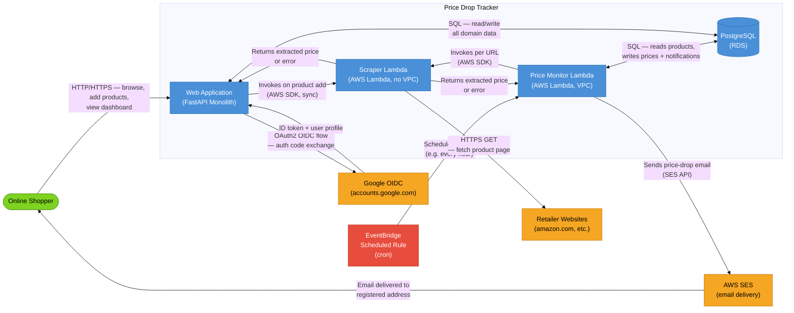
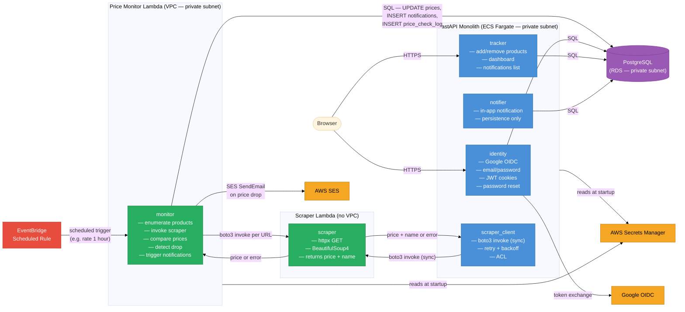
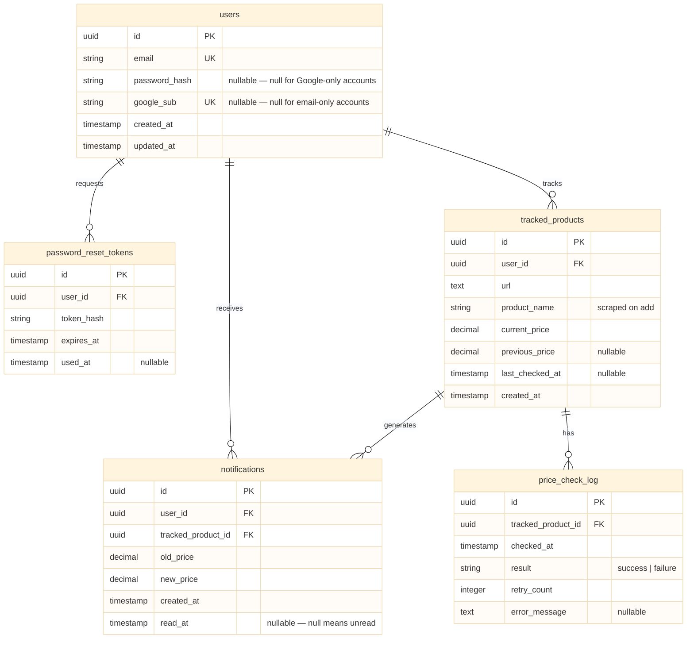
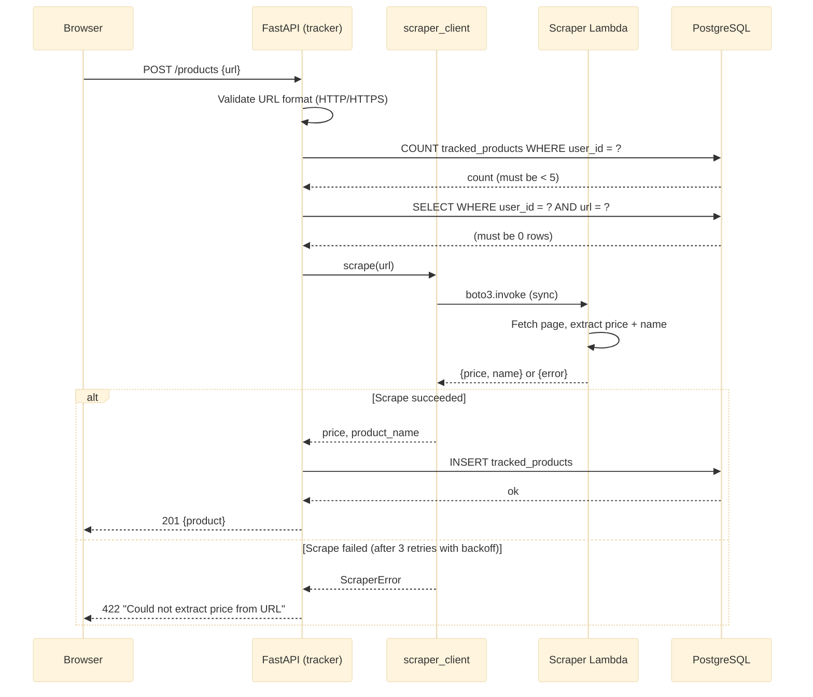

# System Architecture: Price Drop Tracker

**Date:** 2026-03-11
**Status:** Draft
**Author:** Claude Code (via /design-system)
**Feature:** 001-price-drop-tracker

---

## 1. Business Context

**Problem:** Online shoppers miss deals because manually rechecking product prices is tedious. There are no generic, free tools that track any URL without retailer-specific integrations.

**Users:** Individual online shoppers who want automated price drop alerts across any e-commerce site.

**Success Metrics:**
- Users who add ≥1 product return within 7 days (retention signal)
- Price drop email open rate ≥ 30%
- System detects and notifies price drops within one polling cycle

**MVP Scope:** Web-only, single free tier (5 products/user), email + in-app notifications, generic URL scraping, 1,000 users.

---

## 2. Quality Attributes

| Attribute | Target | Rationale |
|-----------|--------|-----------|
| **Availability** | 99.5% monthly | MVP trust signal; brief monitoring gaps tolerated |
| **Latency — Dashboard** | p95 < 2s | Users expect near-instant access |
| **Latency — Product Add** | p95 < 10s (sync) or 30s (async) | Scraping latency is external; progress state required |
| **Security** | Passwords bcrypt ≥ cost 12; HTTPS only; HTTP-only secure cookies; tokens expire 1h | Passwords are the primary attack surface |
| **Scalability** | 1,000 users × 5 products = 5,000 tracked products; horizontal scale of web layer | Design for 10x without re-architecture |
| **Fault Tolerance** | Single product failure must not block other products; 3 retries with exponential backoff | Scraping is inherently unreliable |
| **Observability** | Structured logs for price-check start/end/failure; health endpoint; alert on >5% failure rate | Scraping failures are silent to users |

---

## 3. Architecture Style

**Selected: Modular Monolith + Two Isolated Lambdas (Scraper + Price Monitor)**

A single FastAPI application with clearly separated modules (Identity, Tracker, Notifier) backed by one PostgreSQL database. Periodic price monitoring runs as a separate **Price Monitor Lambda** triggered by an EventBridge Scheduled Rule — completely decoupled from the web process. URL scraping runs in a further isolated **Scraper Lambda** invoked by the Price Monitor Lambda and by the web app on product add.

**Justification:**
- Single developer: one primary codebase (FastAPI), two focused Lambdas; all managed by AWS
- EventBridge scheduling: durable, observable, serverless — no scheduler process to crash or restart; fires reliably even if the web app is redeployed or restarted
- Price Monitor Lambda isolation: price-check cycles run independently of web traffic; a slow or failed cycle never affects dashboard latency
- Scraping isolation: Scraper Lambda has separate resource limits and failure scope; crash-prone scraping code never touches the web process
- AWS-native stack: SES (email), Lambda (scraping + monitoring), EventBridge (scheduling), RDS (database), Secrets Manager (credentials) — all managed services

**Not selected:**
- APScheduler in-process: scheduler state lost on container restart; monitoring cycle coupled to web app lifecycle; not appropriate for a declared production system
- Microservices: overkill for one developer; distributed systems complexity without benefit at this scale

---

## 4. Bounded Contexts

### Context Map

| Context | Domain Type | Responsibility |
|---------|-------------|----------------|
| **Identity** | Supporting | User registration (email + Google OIDC), login, password management, session tokens |
| **Tracker** | Core | Product URL submission, dashboard, tracked product CRUD, in-app notifications |
| **Monitor** | Supporting | Periodic price-check orchestration (EventBridge → Lambda), price comparison, drop detection, notification triggering |
| **Scraper** | Generic | Stateless URL → price extraction; implemented as AWS Lambda (no VPC); no domain logic |
| **Notifier** | Supporting | Email delivery via AWS SES; in-app notification persistence |

### Context Relationships

- **Tracker → Monitor**: Tracker writes tracked products to the shared DB; Monitor Lambda reads these to drive price checks
- **Monitor → Scraper**: Price Monitor Lambda invokes Scraper Lambda per URL; Scraper has no domain knowledge, returns price or error
- **Monitor → Notifier**: Price Monitor Lambda writes in-app notifications to DB and invokes SES directly on price drop
- **Identity → Tracker**: Identity provides authenticated user context; all Tracker operations are scoped to the authenticated user
- **EventBridge → Monitor**: EventBridge Scheduled Rule fires on cron schedule and triggers the Price Monitor Lambda
- **Scraper ← Google OIDC**: Identity context consumes Google's OIDC token endpoint as an upstream external system via an Anti-Corruption Layer



---

## 5. Component Architecture

### Module Breakdown

**FastAPI Monolith (ECS Fargate)** — handles all user-facing requests:

| Module | Responsibilities |
|--------|----------------|
| `identity` | Google OIDC OAuth2 flow, email/password auth, bcrypt, JWT session cookies, password reset tokens |
| `tracker` | Add/remove tracked products, dashboard endpoint, in-app notification read/dismiss |
| `notifier` | In-app notification persistence (read by dashboard); SES used directly by Monitor Lambda |
| `scraper_client` | Anti-corruption layer: `boto3` call to Scraper Lambda on product add, response parsing, retry with backoff |

**Price Monitor Lambda** (VPC, private subnet — needs RDS access) — runs on EventBridge schedule:

| Responsibility | Detail |
|---------------|--------|
| Enumerate products | Query `tracked_products` for all active records |
| Invoke scraper | Call Scraper Lambda per URL with bounded concurrency |
| Compare prices | Detect strict price drops; update `current_price`, `previous_price`, `last_checked_at` |
| Notify | `INSERT notifications`; call SES `SendEmail` on price drop |
| Log outcomes | `INSERT price_check_log` for every product (success or failure) |

**Scraper Lambda** (no VPC — fetches public URLs):

| Responsibility | Detail |
|---------------|--------|
| Fetch page | `httpx` GET with timeout; no auth, no cookies |
| Extract price + name | `BeautifulSoup4` HTML parse; returns `{price, name}` or structured error |
| No state | Purely functional; no DB, no SES, no side effects |

> **Scheduling:** EventBridge Scheduler rule fires on a configurable cron expression (e.g., `rate(1 hour)`). The rule directly invokes the Price Monitor Lambda with no intermediate queue. If the Lambda fails mid-cycle, individual product failures are logged but do not retry the whole cycle — the next EventBridge trigger starts a fresh cycle.



---

## 6. Data Architecture

**Storage:** Single RDS PostgreSQL instance (t3.micro for MVP, vertically scalable). All bounded contexts share one database; module isolation is enforced at the application layer (each module owns its tables and never queries another module's tables directly).

**Data Ownership per Context:**

| Table | Owning Module | Description |
|-------|--------------|-------------|
| `users` | identity | Registered users, credential hashes, Google subject IDs |
| `password_reset_tokens` | identity | Expiring tokens for password reset flow |
| `tracked_products` | tracker | URLs being monitored, current/previous price, last-checked timestamp |
| `notifications` | notifier | In-app price-drop notifications per user |
| `price_check_log` | monitor | Audit log of check outcomes (success, failure, retry count) |



**Key Data Decisions:**
- UUIDs (v4) for all primary keys — distributed-ready from day one
- `DECIMAL(10,2)` for prices — never `FLOAT` for monetary values
- `google_sub` and `password_hash` are independently nullable — supports both auth methods and future account linking
- `previous_price` is a single field (no time-series) — matches PRD constraint (no price history in MVP)
- Unique constraint on `(user_id, url)` in `tracked_products` — enforces FR-5 duplicate URL check
- Check constraint on `tracked_products` count per user (≤5) enforced at application layer; DB constraint optional for defense-in-depth

---

## 7. Integration Architecture

### Key Flows

#### Flow 1: Add Product (User-Triggered Scrape)



#### Flow 2: Periodic Price Check (EventBridge → Price Monitor Lambda)

```mermaid
%%{init: {'theme': 'base'}}%%
sequenceDiagram
  accTitle: Periodic Price Check Flow
  accDescr: EventBridge triggers Price Monitor Lambda which checks all active products and notifies on price drops

  participant EB as EventBridge
  participant Monitor as Price Monitor Lambda
  participant Scraper as Scraper Lambda
  participant DB as PostgreSQL
  participant SES as AWS SES

  EB->>Monitor: scheduled event (cron trigger)
  Monitor->>DB: SELECT all active tracked_products
  DB-->>Monitor: list of products

  loop For each product (bounded concurrency)
    Monitor->>Scraper: boto3.invoke (async per URL)
    Scraper-->>Monitor: {price, name} or {error}

    alt New price < current price
      Monitor->>DB: UPDATE current_price, previous_price, last_checked_at
      Monitor->>DB: INSERT price_check_log (success)
      Monitor->>DB: INSERT notifications
      Monitor->>SES: SendEmail (product name, old price, new price, URL)
    else Same or higher price
      Monitor->>DB: UPDATE last_checked_at only
      Monitor->>DB: INSERT price_check_log (success)
    else Scrape failed (after 3 retries with backoff)
      Monitor->>DB: INSERT price_check_log (failure, retry_count, error_type)
      Note over Monitor: last_checked_at NOT updated; user not notified
    end
  end
```

#### Flow 3: Google OIDC Login

```mermaid
%%{init: {'theme': 'base'}}%%
sequenceDiagram
  accTitle: Google OIDC Login Flow
  accDescr: OAuth2 authorization code flow for Google Sign-In

  participant Browser
  participant API as FastAPI (identity)
  participant Google as Google OIDC

  Browser->>API: GET /auth/google/login
  API-->>Browser: Redirect to Google consent screen
  Browser->>Google: User consents
  Google-->>Browser: Redirect to /auth/google/callback?code=...
  Browser->>API: GET /auth/google/callback?code=...
  API->>Google: POST token endpoint (code exchange)
  Google-->>API: id_token + access_token
  API->>API: Verify id_token signature + claims
  API->>API: Extract sub, email from id_token

  alt User exists (by google_sub or email)
    API->>API: Link google_sub if email matched
  else New user
    API->>API: INSERT users (email, google_sub, no password_hash)
  end

  API->>API: Generate JWT session token
  API-->>Browser: Set-Cookie: session=JWT; HttpOnly; Secure; SameSite=Lax
  Browser->>Browser: Redirect to /dashboard
```

---

## 8. Resilience Strategy

| Failure Mode | Detection | Mitigation |
|-------------|-----------|------------|
| **Single product scrape fails** | Lambda returns error / timeout | Retry up to 3× with exponential backoff + jitter; log failure; skip that product; continue cycle |
| **Lambda cold start latency** | Increased p99 on product add | Provisioned concurrency on Scraper Lambda (optional for MVP); acceptable latency range per NFR-2 |
| **SES delivery failure** | SES API error | Retry once immediately; on failure, log error; in-app notification still created (dual-channel redundancy) |
| **RDS connection exhaustion** | DB connection errors | SQLAlchemy connection pool with `pool_size=10, max_overflow=5`; fail fast with 503 rather than queuing |
| **Price check cycle overrun** | Cycle takes longer than poll interval | Bounded concurrency (`asyncio.Semaphore` with limit 20) on Scraper Lambda invocations; Price Monitor Lambda timeout set to 10 min (well within 5,000-product budget) |
| **EventBridge rule misconfigured or disabled** | No price checks run silently | CloudWatch alarm on `Invocations` metric for Price Monitor Lambda — alert if count = 0 over expected interval |
| **Price Monitor Lambda VPC cold start** | First invocation of cycle is slow | Provisioned concurrency = 1 on Monitor Lambda; amortized cost is negligible vs. hourly trigger frequency |
| **Retailer blocks scraper** | Lambda returns no price extracted | Log with URL + error type; product `last_checked_at` not updated; surfaced in observability alerts |

---

## 9. Security Architecture

### Authentication & Session

- **Email/password:** bcrypt with cost factor 14 (exceeds NFR-4 minimum of 12)
- **Google OIDC:** Authorization code flow (PKCE); id_token verified locally using Google's public JWKS endpoint; `state` parameter prevents CSRF on callback
- **Sessions:** JWT signed with HS256 (secret from Secrets Manager); stored as `HttpOnly; Secure; SameSite=Lax` cookie; 24h expiry
- **Password reset tokens:** Stored as bcrypt hash in DB; expire after 1 hour; single-use (marked `used_at` on redemption)

### Authorization

- All `/api/*` routes require valid JWT session; user_id extracted from token, never from request body
- All DB queries include `WHERE user_id = :user_id` — no cross-user data leakage possible at query level
- Tracked product operations verify `product.user_id == session.user_id` before any mutation

### Input Validation & Abuse Prevention

- URL validation: must parse as valid `http://` or `https://` scheme; reject `file://`, `localhost`, RFC-1918 addresses (SSRF prevention)
- Rate limit: max 10 product-add attempts per user per hour (in-memory token bucket for MVP; replace with Redis on scale-out)
- 5-product limit enforced at application layer before any scraping is attempted

### Secrets Management

| Secret | Storage |
|--------|---------|
| JWT signing secret | AWS Secrets Manager |
| DB connection string | AWS Secrets Manager |
| Google OAuth2 client ID + secret | AWS Secrets Manager |
| SES SMTP credentials / IAM role | IAM role attached to ECS task (no credentials in code) |
| Scraper Lambda invocation | IAM role attached to ECS task + IAM role attached to Monitor Lambda |
| Monitor Lambda invocation | IAM role attached to EventBridge rule (resource-based policy on Lambda) |

### Transport & Infrastructure

- All traffic over HTTPS (TLS 1.2+); enforced at ALB
- RDS in private subnet; accessible only from ECS task security group and Monitor Lambda security group
- **Scraper Lambda**: no VPC — fetches public retailer URLs; network egress unrestricted for scraping
- **Price Monitor Lambda**: in VPC private subnet — security group allows outbound to RDS (port 5432) and AWS service endpoints (SES, Lambda) only; no public internet access for DB operations
- EventBridge rule has IAM execution role with `lambda:InvokeFunction` permission on Monitor Lambda only
- No PII in logs or traces: user emails replaced with `user_id` in all structured log fields

---

## 10. Technology Decisions

| Decision | Choice | Alternatives Considered | Rationale |
|----------|--------|------------------------|-----------|
| **Web framework** | FastAPI (Python) | Django, Flask | Async-native, Pydantic validation built in, OpenAPI generation; team expertise |
| **Database** | PostgreSQL (RDS) | MySQL, SQLite, DynamoDB | Best relational fit; strong ACID; rich type system; team expertise; RDS is fully managed |
| **Auth — Google** | Direct OAuth2 via `Authlib` | Cognito, Auth0 | No third-party auth service cost; full control; Cognito adds complexity without MVP benefit |
| **Scheduling** | EventBridge Scheduled Rule | APScheduler (in-process), cron on EC2 | Durable, serverless, observable; fires reliably independent of web app lifecycle; no scheduler process to crash |
| **Scraping runtime** | AWS Lambda (Python + `httpx` + `BeautifulSoup4`) | Playwright headless Lambda, Scrapy, external scraping API | Lightweight for HTML-served prices; Playwright layer available if JS-rendered sites are required; Lambda isolates scraping failures |
| **Email** | AWS SES | SendGrid, Mailgun | AWS-native; low cost; no additional vendor |
| **Secrets** | AWS Secrets Manager | SSM Parameter Store, env vars | Rotation support; audit log; native ECS integration |
| **Deployment** | ECS Fargate (single task) | EC2, Kubernetes, Lambda monolith | Fully managed; no server patching; simple for single developer; scales by adding tasks |
| **ORM** | SQLAlchemy 2.x (async) | Django ORM, raw psycopg2 | Mature; async support; Alembic for migrations; works with FastAPI |
| **Migrations** | Alembic | Flyway, manual SQL | First-class SQLAlchemy integration; version-controlled schema |

---

## 11. Risks & Mitigations

| Risk | Impact | Likelihood | Mitigation |
|------|--------|-----------|------------|
| **Anti-bot protection (Cloudflare, CAPTCHA) blocks scraper** | Core feature unavailable for blocked retailers | High | Run scraping spike before implementation; have Playwright Lambda layer ready to swap; consider scraping API (ScrapingBee, Apify) as fallback — evaluate cost vs. reliability |
| **Lambda scraping is brittle for JS-rendered prices** | Incorrect or missing prices | Medium | Use `httpx` + `BeautifulSoup4` first; Playwright Lambda layer available as upgrade path without architecture change |
| **Price Monitor Lambda in VPC — cold start adds ~1s** | First check of each cycle delayed | Low (one cold start per scheduled trigger) | Provisioned concurrency = 1; acceptable within cycle window; monitor `InitDuration` metric |
| **RDS connection pool exhaustion under load** | Dashboard 503s | Low at MVP scale | Pool configured conservatively; 503 response rather than queuing; alert on pool saturation |
| **Google OIDC changes API / deprecates endpoint** | Login broken | Very Low | Use `Authlib` with JWKS auto-discovery; always pin to `/.well-known/openid-configuration`; version tolerance |
| **SES sandbox limits in early deployment** | Emails not delivered | Medium (early stage) | Request SES production access before launch; test with verified addresses in sandbox |
| **Single ECS task is a SPOF** | App downtime = service outage | Medium | ECS health checks + auto-restart covers transient failures; 99.5% SLA acceptable for MVP; add second task for HA if needed |

---

## 12. Observability Contract

| Signal | What is Logged/Measured | Alert Condition |
|--------|------------------------|-----------------|
| **Price check cycle** | `level=info event=price_check_cycle_start products_count=N` / `_end duration_ms=N success=N failed=N` | `failed / products_count > 0.05` |
| **Scraping failure** | `level=warn event=scrape_failed url_hash=<sha256> error_type=timeout\|parse\|http status=N retry=N` | — (covered by cycle alert) |
| **Notification sent** | `level=info event=email_sent user_id=<uuid> product_id=<uuid>` | SES bounce rate > 5% |
| **Notification failed** | `level=error event=email_failed user_id=<uuid> error=<type>` | Any failure |
| **Auth events** | `level=info event=login_success\|login_failed method=google\|password` | login_failed rate > 20/min |
| **Health endpoint** | `GET /health` → `{status: ok, db: ok}` | Non-200 for > 30s |

No PII (email, name) in any log field. Use `user_id` (UUID) and `url_hash` (SHA-256 of URL) as safe identifiers.

---

## 13. Deployment Topology

```
Internet
    │
    ▼
[ALB — HTTPS termination, TLS 1.2+]           [EventBridge Scheduled Rule]
    │                                                      │
    ▼                                                      ▼
[ECS Fargate Task — FastAPI app]        [Price Monitor Lambda — VPC, private subnet]
 (private subnet)                                          │
    │                                                      ├─── [RDS PostgreSQL — private subnet]
    ├─── [RDS PostgreSQL — private subnet]                 ├─── [Scraper Lambda — no VPC]
    ├─── [Scraper Lambda — no VPC]                         └─── [AWS SES — email delivery]
    ├─── [AWS Secrets Manager]
    └─── [Google OIDC — external]
```

All AWS resources in a single region (e.g., `us-east-1`). Single VPC: public subnets (ALB), private subnets (ECS Fargate, RDS, Price Monitor Lambda). Scraper Lambda has no VPC — fetches public URLs. EventBridge and SES are regional AWS services accessed via VPC endpoints or NAT Gateway.

---

## 14. Next Steps — LLD Downstream

| Area | Skill to Invoke | Input from HLD |
|------|----------------|---------------|
| **REST API contracts** | `/design-api` | Tracker module endpoints: `POST /products`, `DELETE /products/{id}`, `GET /products`, `GET /notifications`, `PATCH /notifications/{id}/read` |
| **Auth API contracts** | `/design-api` | Identity endpoints: `POST /auth/register`, `POST /auth/login`, `POST /auth/logout`, `GET /auth/google/login`, `GET /auth/google/callback`, `POST /auth/password-reset`, `POST /auth/password-reset/confirm`, `PUT /auth/password` |
| **Data model design** | `/design-data` | Tables: `users`, `password_reset_tokens`, `tracked_products`, `notifications`, `price_check_log`; access patterns from Section 6 |
| **Scraper Lambda design** | `/design-code` | Scraper module: URL in → price + name out; retry logic; error taxonomy |
| **Monitor Lambda design** | `/design-code` | Price Monitor Lambda: EventBridge handler, bounded concurrency, price comparison, drop detection, SES dispatch, VPC + RDS connection management |
| **Frontend design** | `/design-web` | Dashboard, add-product form, notification badge, login/register pages |
