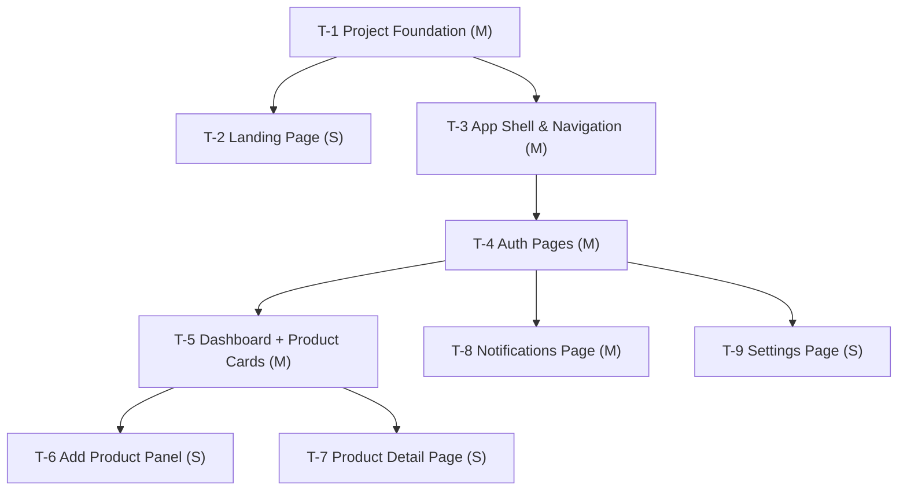

# Task Breakdown: Price Alert Frontend

## Summary

- **Total tasks:** 9
- **Estimated complexity:** 4S + 5M + 0L
- **Critical path:** T-1 → T-3 → T-4 → T-5 → T-6 (5 steps — foundation → shell → auth → dashboard → add-product panel)
- **Parallelization tiers:** 5 tiers, max 3 tasks concurrent (Tier 3)
- **Design reference:** `docs/designs/frontend_design.md`
- **Backend API:** All endpoints live at `/api/v1/...` on the webapp service (see `services/webapp/webapp/domains/*/routes/v1/`)

---

## Dependency Graph

---

## Implementation Sequence

### Tier 0 — Foundation

#### T-1: Project Foundation
- **Description:** Vite + React 18 + TypeScript scaffold; Tailwind CSS + shadcn/ui; TanStack Query; Zustand auth store (localStorage-persisted); Axios client with `withCredentials: true` and 401 interceptor; React Router v6 skeleton; all TypeScript types; Zod schemas; utility functions (formatPrice, formatDate, priceDiff, cn).
- **Vertical slice:** Runnable dev server with type-checked skeleton routes and a working API client that sends the session cookie.
- **Complexity:** M
- **Dependencies:** None
- **Parallelizable with:** —
- **Details:** [001-project-foundation.md](tasks/001-project-foundation.md)

---

### Tier 1 — Shell & Landing (parallel)

#### T-2: Landing Page
- **Description:** Static marketing page: hero headline + CTAs ("Get Started Free" → `/signup`, "Log In" → `/login`), 3-step how-it-works section, footer with log-in link.
- **Vertical slice:** Visitor can read the value proposition and navigate to sign-up or log-in.
- **Complexity:** S
- **Dependencies:** Hard: T-1
- **Parallelizable with:** T-3
- **Details:** [002-landing-page.md](tasks/002-landing-page.md)

#### T-3: App Shell & Navigation
- **Description:** AppShell (authenticated layout wrapper), TopNav (logo + NotificationBell + UserMenu), SideNav (desktop sidebar), BottomNav (mobile), PrivateRoute + PublicOnlyRoute guards, full responsive breakpoints.
- **Vertical slice:** Authenticated user sees the persistent shell; unauthenticated user is redirected to `/login`.
- **Complexity:** M
- **Dependencies:** Hard: T-1
- **Parallelizable with:** T-2
- **Details:** [003-app-shell-navigation.md](tasks/003-app-shell-navigation.md)

---

### Tier 2 — Auth Pages

#### T-4: Auth Pages
- **Description:** SignUpPage, LoginPage, ForgotPasswordPage, ResetPasswordPage; shared AuthCard + PasswordInput components; React Hook Form + Zod validation; cookie auth (no token handling); Google OIDC via `window.location.href` redirect; all API error codes mapped to inline field/form errors.
- **Vertical slice:** User can register, log in, reset password, and log in via Google; session cookie is set; auth store holds `{id, email}`.
- **Complexity:** M
- **Dependencies:** Hard: T-1, T-3
- **Parallelizable with:** —
- **Details:** [004-auth-pages.md](tasks/004-auth-pages.md)

---

### Tier 3 — Authenticated Features (parallel)

#### T-5: Dashboard + Product Cards
- **Description:** DashboardPage; ProductCard (Active, PriceDropped, ScrapeFailed states); ProductGrid (responsive 1/2/3-col); PlanUsageBar (blue/amber/red states); EmptyProducts; SkeletonCard; ConfirmDialog; `useDashboard` hook (30s polling); optimistic remove mutation; `unread_notification_count` drives the bell badge.
- **Vertical slice:** Authenticated user sees their tracked products (all states), removes one with undo toast, sees plan usage.
- **Complexity:** M
- **Dependencies:** Hard: T-3, T-4
- **Parallelizable with:** T-8, T-9
- **Details:** [005-dashboard-product-cards.md](tasks/005-dashboard-product-cards.md)

#### T-8: Notifications Page
- **Description:** NotificationsPage; NotificationItem (unread/read styles); EmptyNotifications; SkeletonList; `useInfiniteNotifications` hook (cursor pagination, 60s refetch); `useReadNotification` mutation (individual dismiss); navigate to `/products/:id` on item click.
- **Vertical slice:** User sees paginated price-drop notifications, clicks to mark read and navigate to product.
- **Complexity:** M
- **Dependencies:** Hard: T-3, T-4
- **Parallelizable with:** T-5, T-9
- **Details:** [008-notifications-page.md](tasks/008-notifications-page.md)

#### T-9: Settings Page
- **Description:** SettingsPage with change-password form (PUT /auth/password); current email display from auth store; plan usage read-only section from dashboard cache; "Contact Support" mailto link.
- **Vertical slice:** User can change their password and see their plan usage from settings.
- **Complexity:** S
- **Dependencies:** Hard: T-3, T-4
- **Parallelizable with:** T-5, T-8
- **Details:** [009-settings-page.md](tasks/009-settings-page.md)

---

### Tier 4 — Product Sub-Pages (parallel)

#### T-6: Add Product Panel
- **Description:** AddProductPanel Sheet component (right slide-in on desktop ≥1024px, bottom sheet on mobile); AddProductForm with Zod URL validation; all API error codes mapped to inline messages; clipboard paste detection; submit spinner; panel triggered from DashboardPage.
- **Vertical slice:** User opens the panel, pastes a URL, submits, and sees the new product card appear in the dashboard.
- **Complexity:** S
- **Dependencies:** Hard: T-5
- **Parallelizable with:** T-7
- **Details:** [006-add-product-panel.md](tasks/006-add-product-panel.md)

#### T-7: Product Detail Page
- **Description:** ProductDetailPage at `/products/:id`; reads product from TanStack Query cache (no extra API call); displays name, URL, current price, previous price, drop amount/%, last checked; remove button with ConfirmDialog → navigate to `/dashboard`.
- **Vertical slice:** User clicks a product card and sees its full detail; removes it from detail page.
- **Complexity:** S
- **Dependencies:** Hard: T-5
- **Parallelizable with:** T-6
- **Details:** [007-product-detail-page.md](tasks/007-product-detail-page.md)

---

## PRD Coverage Matrix

| Requirement | Task(s) | Status |
|-------------|---------|--------|
| FR-1: User Registration | T-4 | Covered |
| FR-2: User Login | T-4 | Covered |
| FR-3: Password Reset | T-4 | Covered |
| FR-4: Change Password | T-9 | Covered |
| FR-5: Add Product to Tracking | T-5, T-6 | Covered |
| FR-6: Remove Product | T-5, T-7 | Covered |
| FR-7: Dashboard — View Products | T-5 | Covered |
| FR-11: In-App Notification on Drop | T-5 (badge), T-8 (list) | Covered |
| FR-12: Support Contact from Settings | T-9 | Covered |
| NFR-1: Dashboard p95 < 2s | T-5 (skeleton, 30s stale) | Covered |
| NFR-4: HttpOnly cookie, no token in JS | T-1 (withCredentials), T-4 | Covered |
| NFR-6: No PII in logs | T-1 (no logging of user data) | Covered |

---

## Risk Notes

- **T-1 (shadcn/ui init):** shadcn/ui CLI modifies `tailwind.config.ts` and `globals.css`. Run `npx shadcn-ui@latest init` before adding components — order matters.
- **T-4 (Google OIDC):** The redirect is `window.location.href = '/api/v1/auth/google/login'`. CORS is not involved (full browser redirect). Ensure `VITE_API_BASE_URL` points to the backend origin in `.env.local`.
- **T-5 (price drop detection):** `hasPriceDrop` is derived client-side from `current_price < previous_price`. Both are decimal strings — always `parseFloat()` before comparing; never do string comparison.
- **T-6 (clipboard API):** `navigator.clipboard.readText()` requires HTTPS or localhost. On non-secure origins it will throw — wrap in try/catch and silently skip auto-fill.
- **T-7 (cache miss):** ProductDetailPage reads from TanStack Query cache. If the user navigates directly to `/products/:id` without visiting the dashboard first, the cache is empty. Redirect to `/dashboard` in that case.
- **T-8 (individual dismiss only):** There is no `PATCH /notifications/read-all` endpoint. Do not implement a "Mark all as read" button — it has no backend support.
