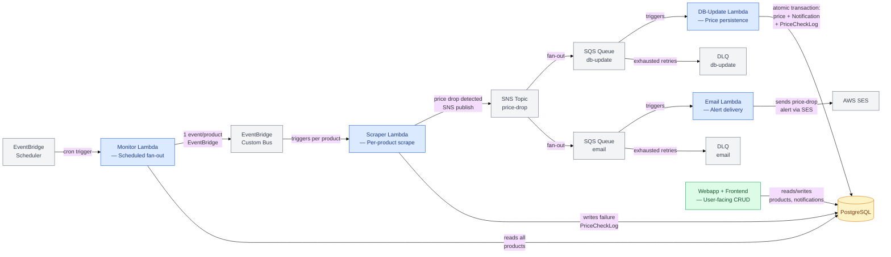
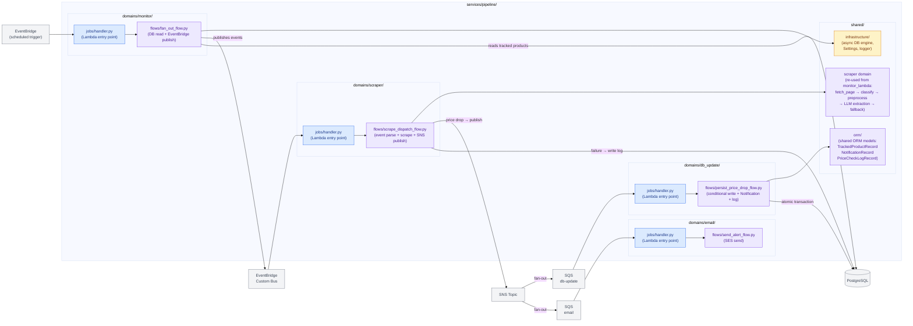
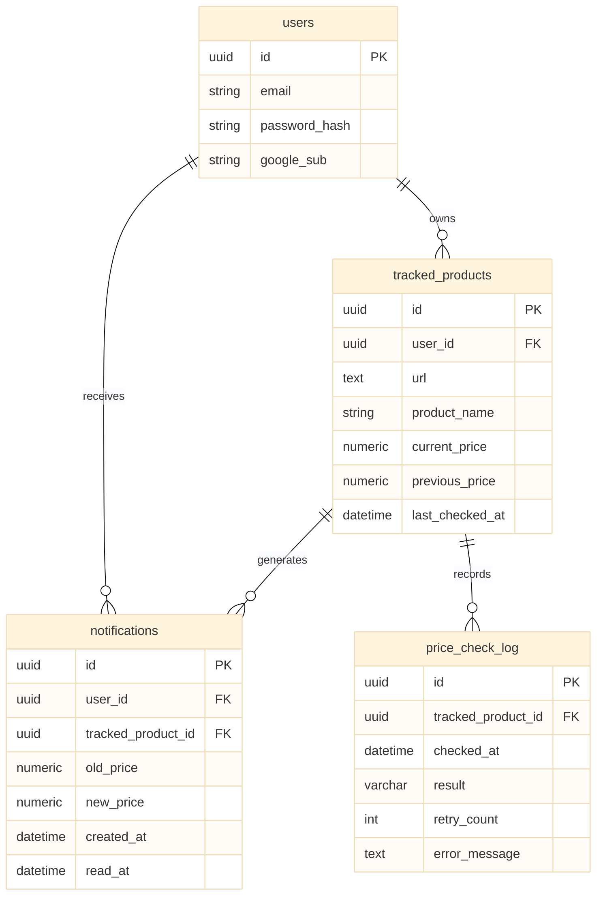
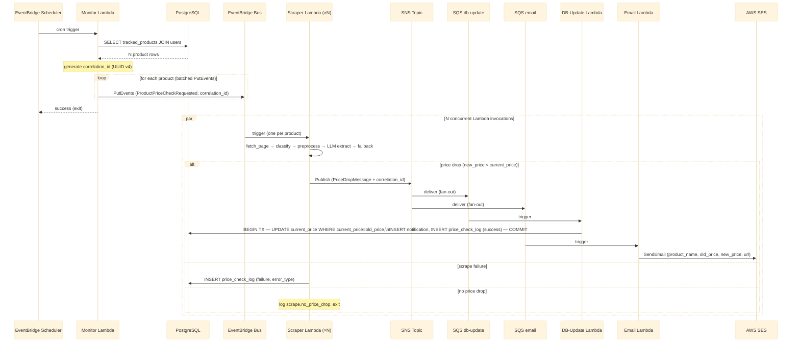

# System Architecture: Event-Driven Price Check Pipeline

**Date:** 2026-03-27
**Status:** Draft
**Feature:** 003-event-driven-price-check-pipeline
**Author:** Claude Code (design-system)

---

## 1. Business Context

### Problem

The existing `monitor_lambda` executes a monolithic price-check cycle: one Lambda invocation fetches every tracked product, scrapes each one (max concurrency: 10), persists results, and dispatches emails — all within a single execution. This architecture has three critical failure modes:

1. **Latency coupling** — a slow scrape (LLM timeout, anti-bot challenge) blocks all other products
2. **Failure coupling** — a DB error or SES failure aborts the entire cycle
3. **Concurrency ceiling** — a semaphore cap of 10 means 5,000 products would require 500 serial batches

### Vision

Replace with a four-stage, message-connected pipeline where each product check is an independent Lambda invocation, failures are isolated by SQS+DLQ, and every stage is independently deployable and observable via a shared `correlation_id`.

### Users & Stakeholders

| Stakeholder | Value |
|---|---|
| End user | Price-drop emails arrive reliably; slow/failed scrapes on other products have no effect |
| Developer | Each Lambda stage can be deployed, tested, and debugged in isolation |
| Operations | DLQs capture all failures; structured logs with `correlation_id` enable end-to-end tracing |

### Success Metrics

- Fan-out of 5,000 products completes within 30 seconds (p95)
- Up to 50% scrape failure rate in a cycle does not block remaining products
- Zero silent message drops (all failures land in DLQ)
- 100% of log entries carry `correlation_id`

---

## 2. Quality Attributes

| Attribute | Target | Rationale |
|---|---|---|
| **Performance — fan-out latency** | ≤30 s for 5,000 products (DB query + all EventBridge publishes) | Fan-out is the critical path gate; slow fan-out delays the entire cycle |
| **Performance — per-product timeout** | 60 s hard timeout per scraper Lambda invocation (configurable) | LLM extraction can be slow; cap prevents indefinite billing |
| **Availability — scrape isolation** | 50% scrape failure rate must not block remaining products | Scrape failures are expected; they must not cascade |
| **Availability — consumer independence** | Full email Lambda outage must not affect DB-update Lambda | Email is lower-priority than data persistence |
| **Scalability — concurrency** | 5,000 concurrent scraper Lambda invocations (1,000 users × 5 products) | Lambda reserved concurrency and SQS batch size are config, not code |
| **Observability — structured logs** | 100% of log entries across all stages: JSON, `correlation_id`, `tracked_product_id`, `snake_case.dot.keys` | Aligns with existing structlog patterns; enables CloudWatch Logs Insights queries |
| **Observability — alerting** | CloudWatch alarm fires when scrape failure rate > 20% per cycle (configurable) | Mirrors existing `_FAILURE_RATE_THRESHOLD` logic; moves it to infra |
| **Security — least-privilege IAM** | Each Lambda has an execution role granting only its required permissions | Engineering principles §1.11 |
| **Security — no PII in logs** | `user_email` never appears raw in any log field; use `user_id` (UUID) | Engineering principles §1.11 |
| **Durability — idempotency** | Replaying the same SQS message produces no duplicate DB records | SQS at-least-once delivery; conditional write strategy (§NFR-10) |

---

## 3. Architecture Style

**Event-Driven Pipeline on AWS Serverless**

This is not a microservices decomposition — the four Lambda stages share a single `services/pipeline/` Python package and a single PostgreSQL database. The distribution is along _messaging boundaries_, not service ownership boundaries. Each stage is a discrete Lambda function connected via AWS managed messaging primitives.

**Why not a modular monolith?** The core driver is concurrency, not team autonomy. One Lambda invocation per product gives true parallelism across the entire catalogue — impossible in a single-process execution model. The event-driven style is the natural fit because:

- Fan-out to N independent workers maps directly to EventBridge events → N Lambda invocations
- Downstream decoupling (DB update vs. email) maps directly to SNS → SQS fan-out
- Independent failure handling (DLQ per queue) maps directly to SQS retry + dead-letter semantics

---

## 4. Bounded Contexts

Five bounded contexts are in scope. The four new pipeline contexts share a package but communicate exclusively through AWS messaging. The existing webapp context is unmodified.



### Context Map

| Context | Responsibility | Upstream | Downstream |
|---|---|---|---|
| **Monitor Lambda** | Read all products from DB; fan out one EventBridge event per product with full context (price, user, URL) | EventBridge Scheduler, PostgreSQL | EventBridge Custom Bus |
| **Scraper Lambda** | Receive per-product event; run scrape flow; publish to SNS if price drop detected; write failure log if scrape fails | EventBridge Custom Bus | SNS, PostgreSQL (failure records only) |
| **DB-Update Lambda** | Consume price-drop SQS message; atomically update price, create Notification, create PriceCheckLog | SQS db-update queue | PostgreSQL |
| **Email Lambda** | Consume price-drop SQS message; send SES alert email | SQS email queue | AWS SES |
| **Webapp** | User-facing product CRUD, notification read, auth — **unchanged** | User browser, PostgreSQL | PostgreSQL |

### Context Relationships

- **Monitor → Scraper**: Conformist. Scraper Lambda consumes EventBridge events whose schema is defined by the Monitor Lambda. Scraper must conform to that schema.
- **Scraper → DB-Update / Email**: Published Language. Scraper defines the SNS message schema; both DB-Update and Email Lambdas are consumers that must accept it.
- **Pipeline → Webapp**: Separate Database Tables. Both share the same PostgreSQL instance and schema, but communicate only through the database (pipeline writes; webapp reads). No direct service-to-service calls.

---

## 5. Component Architecture



### Package Structure

```
services/pipeline/
  pipeline/
    domains/
      monitor/
        flows/fan_out_flow.py        # reads DB → publishes EventBridge events
        jobs/handler.py              # Lambda entry point
        models/domain/               # FanOutEvent, ProductFanOutPayload
        ports/                       # TrackedProductReadPort, EventBridgePublishPort
        adapters/                    # SQLAlchemy read adapter, EventBridge boto3 adapter
      scraper/
        flows/scrape_dispatch_flow.py  # parses event → scrapes → publishes SNS or logs failure
        jobs/handler.py
        models/domain/               # PriceDropMessage (SNS payload)
        ports/                       # SNSPublishPort, PriceCheckLogWritePort
        adapters/                    # SNS boto3 adapter, SQLAlchemy log adapter
      db_update/
        flows/persist_price_drop_flow.py  # conditional write + Notification + PriceCheckLog
        jobs/handler.py
        models/domain/               # PriceDropSQSMessage
        ports/                       # TrackedProductWritePort, NotificationWritePort, LogWritePort
        adapters/                    # SQLAlchemy adapters (transactional)
      email/
        flows/send_alert_flow.py     # parses SQS message → sends SES email
        jobs/handler.py
        models/domain/               # EmailAlertPayload
        ports/                       # EmailSenderPort
        adapters/                    # SESEmailSender (re-use or mirror from monitor_lambda)
    shared/
      scraper_domain/                # re-used verbatim: fetch_page, classify_response, preprocess_html,
                                     #   extract_price, extract_name, LLM clients, ScraperResult
      orm/
        tracked_product_record.py    # single canonical ORM model
        notification_record.py
        price_check_log_record.py
      infrastructure/
        database.py                  # async engine factory
        settings.py                  # Settings dataclass (all env vars)
        logger.py                    # structlog configuration
  pyproject.toml
  main_monitor.py                    # Lambda bootstrap for monitor stage
  main_scraper.py                    # Lambda bootstrap for scraper stage
  main_db_update.py                  # Lambda bootstrap for db-update stage
  main_email.py                      # Lambda bootstrap for email stage
```

---

## 6. Data Architecture

### Schema Note: No Status Filter

The monitor Lambda fetches **all tracked products** from the database — no `status` filter is applied. The current schema has no `status` column and none is required. Every product row in `tracked_products` is eligible to be checked on each scheduled cycle.

### Data Ownership per Stage



| Table | Read by | Written by | Stage |
|---|---|---|---|
| `tracked_products` | Monitor Lambda (all rows) | DB-Update Lambda (price + last_checked_at) | Monitor reads; DB-Update writes |
| `notifications` | Webapp (tracker domain) | DB-Update Lambda | DB-Update writes |
| `price_check_log` | Ops/monitoring | Scraper Lambda (failures), DB-Update Lambda (success) | Split ownership by outcome |
| `users` | Monitor Lambda (JOIN for email) | Webapp (identity domain) | Monitor reads; webapp writes |

### Event / Message Payloads

**EventBridge Per-Product Event** (Monitor → Scraper):
```json
{
  "source": "dealio.pipeline.monitor",
  "detail-type": "ProductPriceCheckRequested",
  "detail": {
    "tracked_product_id": "uuid",
    "url": "https://...",
    "current_price": "29.99",
    "user_id": "uuid",
    "user_email": "user@example.com",
    "product_name": "Example Product",
    "correlation_id": "uuid-v4"
  }
}
```

**SNS Price-Drop Message** (Scraper → DB-Update + Email):
```json
{
  "tracked_product_id": "uuid",
  "user_id": "uuid",
  "user_email": "user@example.com",
  "product_name": "Example Product",
  "product_url": "https://...",
  "old_price": "29.99",
  "new_price": "24.99",
  "correlation_id": "uuid-v4"
}
```

All prices serialized as strings (Decimal-safe). `user_email` is present in payloads for delivery purposes but **must never appear in log values** (log `user_id` only, per NFR-9).

---

## 7. Integration Architecture

### Key Flow: Scheduled Fan-Out → Scrape → Price Drop



### Integration Decisions

| Boundary | Pattern | Protocol | Contract Owner |
|---|---|---|---|
| EventBridge Scheduler → Monitor | Sync trigger | AWS Lambda invoke | EventBridge (cron rule) |
| Monitor → EventBridge Bus | Async publish | `PutEvents` API | Monitor Lambda defines event schema |
| EventBridge Bus → Scraper | Async trigger | AWS Lambda invoke via event rule | Monitor Lambda (published language) |
| Scraper → SNS | Async publish | `Publish` API | Scraper Lambda defines SNS message schema |
| SNS → SQS queues | Async fan-out | SQS subscription | SNS (delivery) |
| SQS → DB-Update / Email | Async pull | Lambda event source mapping | Scraper Lambda (message schema) |
| DB-Update / Email → PostgreSQL | Sync I/O | asyncpg / SQLAlchemy | DB schema (Alembic) |
| Email Lambda → SES | Sync call | SES `SendEmail` API | Email Lambda |

---

## 8. Resilience Strategy

### Failure Mode Analysis

| Failure Mode | Impact Scope | Mitigation |
|---|---|---|
| Single scrape times out / errors | That product only | Scraper Lambda has 60 s hard timeout; writes failure log; no cascade to other invocations |
| All scrapes in a cycle fail (>20%) | Alerting fires | CloudWatch alarm on scrape failure metric; DLQ captures nothing (scrape failures are logged, not DLQ'd) |
| DB-Update Lambda throws unhandled exception | One price-drop message | SQS retries up to configured max; message lands in DLQ; email Lambda is unaffected |
| Email Lambda fails | One email not sent | SQS retries; DLQ; DB-update Lambda is unaffected (separate queue) |
| SNS delivery fails | Both downstream consumers | SNS built-in retry; SQS provides durable queue — messages survive transient SNS issues |
| PostgreSQL unavailable | Monitor can't fan out; DB-Update can't persist | EventBridge event is already published before DB write fails; fan-out blocked until DB recovers |
| Duplicate SQS message delivered | DB-Update receives same message twice | Conditional write: `UPDATE ... WHERE current_price = old_price` — second delivery is a no-op |

### DLQ Configuration

Both SQS queues have a DLQ. `maxReceiveCount` and visibility timeout are Pulumi config parameters, not hardcoded.

### Scrape Failure Handling (Silent Termination)

Per FR-2 and NFR-3: a scrape failure results in:
1. A `PriceCheckLog` record written to PostgreSQL with `result = 'failure'` and `error_type`
2. No SNS publish
3. No change to `current_price`
4. Structured log entry with `correlation_id` and `tracked_product_id`

The product will be re-checked on the next scheduled cycle.

---

## 9. Security Architecture

### IAM Execution Roles (Least Privilege)

| Lambda | Permissions |
|---|---|
| Monitor Lambda | `rds-data:*` or `secretsmanager:GetSecretValue` (DB credentials), `events:PutEvents` on the pipeline custom bus |
| Scraper Lambda | `sns:Publish` on the price-drop topic; `secretsmanager:GetSecretValue` (DB credentials, LLM API key); `rds-data:*` (failure log write) |
| DB-Update Lambda | `sqs:ReceiveMessage`, `sqs:DeleteMessage`, `sqs:GetQueueAttributes` on db-update queue; `rds-data:*` or DB credentials |
| Email Lambda | `sqs:ReceiveMessage`, `sqs:DeleteMessage`, `sqs:GetQueueAttributes` on email queue; `ses:SendEmail` |

### PII Protection

- `user_email` is included in EventBridge event payloads and SNS messages (required for delivery) but **must not appear in any structured log value** across all four stages
- Log the `user_id` (UUID) as the identity key in all structured log entries
- No PII in DLQ message attributes or CloudWatch metrics

### Secrets Management

- LLM API key, DB credentials, SES from-address: injected via AWS Secrets Manager or environment variables from Pulumi config — never hardcoded in source
- JWT secret, Google OAuth credentials: remain in webapp environment only; not accessible to pipeline Lambdas

---

## 10. Technology Decisions

| Decision | Choice | Alternatives Considered | Rationale |
|---|---|---|---|
| **Fan-out scheduler** | AWS EventBridge Scheduler (scheduled rule) | CloudWatch Events, Lambda cron layer | EventBridge is the modern AWS scheduler; native Lambda trigger; schedule expression is config |
| **Per-product trigger** | EventBridge Custom Bus (PutEvents) | SQS + Lambda trigger, Step Functions | EventBridge supports up to 10 events per PutEvents call (batchable); native Lambda event source; schema registry optional; aligns with async-first principle |
| **Price-drop fan-out** | AWS SNS → 2 SQS subscriptions | Direct Lambda invoke, EventBridge again | SNS→SQS is the canonical AWS fan-out pattern; each consumer has its own queue, retry policy, and DLQ; decouples email failures from DB failures |
| **Consumer trigger** | SQS Lambda event source mapping | Direct SNS trigger | SQS gives durable buffering, configurable batch size, visibility timeout, and DLQ — critical for idempotency and retry |
| **Email delivery** | AWS SES (existing `SESEmailSender`) | SendGrid, Mailgun | SES already integrated; no new vendor; cost-effective at this scale |
| **Database** | PostgreSQL via async SQLAlchemy (asyncpg) | No change | Existing ORM models and Alembic schema; no new technology |
| **IaC** | Pulumi (Python) | CDK, Terraform, SAM | Existing Pulumi patterns in this repository |
| **Package structure** | Single `services/pipeline/` uv workspace member | One package per Lambda | Four Lambdas share domain code, ORM models, and infra utilities — one package avoids duplication; each Lambda has its own entry point |
| **Scraper re-use** | Copy-reference scraper domain from `monitor_lambda` into `pipeline/shared/scraper_domain/` | Import directly from monitor_lambda package | `monitor_lambda` is a separate uv workspace member; cross-package import creates coupling; shared copy within `pipeline/shared/` is explicit and self-contained |

### EventBridge Batching Note

EventBridge `PutEvents` accepts up to 10 events per API call. For 5,000 products, the Monitor Lambda will issue 500 batched API calls. This is the dominant factor in fan-out latency. The 30-second NFR-1 target is achievable: 500 calls × ~50 ms each (async, concurrent) ≈ 2–5 seconds for pure EventBridge publish at p95.

---

## 11. Risks & Mitigations

| Risk | Impact | Likelihood | Mitigation |
|---|---|---|---|
| ORM model duplication (tracked sooner) | `webapp`, `monitor_lambda`, and `pipeline` each define their own ORM records | High — currently exists | `pipeline/shared/orm/` becomes the canonical ORM location; future migration task to consolidate webapp and monitor_lambda |
| Lambda concurrency limit (AWS account default: 1,000) | Fan-out of 5,000 products throttled; EventBridge events queued or dropped | Medium | Set reserved concurrency via Pulumi config; request quota increase via AWS Support before production; EventBridge retries throttled invocations |
| EventBridge `PutEvents` payload limit (256 KB per event, 256 KB per batch) | Product with very long URL or name may exceed limits | Low | `url` is TEXT, `product_name` is VARCHAR(500); total detail payload is well under 10 KB per event |
| DB connection exhaustion from concurrent Scraper Lambda invocations | DB-update Lambda and Monitor Lambda fail to connect | Medium — 5,000 concurrent invocations × 1 connection each = 5,000 connections | Scraper Lambda does not hold a DB connection open during scrape (DB access only on failure path); DB-update Lambda connects only at message processing time; PgBouncer or RDS Proxy recommended before production at scale |
| Scraper Lambda cold start latency | First-batch scrapes are slow; some may approach 60 s timeout | Low-Medium | Provision concurrency for scraper Lambda via Pulumi config (configurable parameter) |
| ORM model duplication across services | `webapp`, `monitor_lambda`, and `pipeline` each define their own ORM records | High — currently exists | `pipeline/shared/orm/` becomes the canonical ORM location; future migration task to consolidate webapp and monitor_lambda to import from a shared lib |
| SQS at-least-once delivery creates duplicate Notifications | User receives two emails / two notification records for the same price drop | Medium | Conditional write (`WHERE current_price = old_price`) is the idempotency guard; prevents duplicate records on replay |

---

## 12. Next Steps (Downstream Skills)

The HLD is complete. LLD work must be anchored to the bounded contexts and technology choices defined above.

| LLD Dimension | Skill | Scope |
|---|---|---|
| **Data design** | `/design-data` | Canonical ORM models in `pipeline/shared/orm/`; EventBridge event and SNS message Pydantic schemas |
| **Event design** | `/design-event` | EventBridge event schema (`ProductPriceCheckRequested`), SNS message schema (`PriceDropMessage`), SQS envelope handling |
| **Code design** | `/design-code` | Per-stage domain models, flow orchestration, port definitions, adapter interfaces |
| **Infrastructure design** | `/design-pulumi` | Pulumi stack: EventBridge rule + custom bus, SNS topic, 2× SQS queues + DLQs, 4× Lambda functions, IAM roles, CloudWatch alarm |

### Implementation Order (respects data → event → code → infra sequencing)

1. **Shared ORM + Settings** — establish canonical models in `pipeline/shared/`
2. **Event + message contracts** — Pydantic schemas for EventBridge payload and SNS message
3. **Monitor Lambda** — fan-out flow + EventBridge publish adapter
4. **Scraper Lambda** — event parse + scrape dispatch + SNS publish adapter
5. **DB-Update Lambda** — conditional write flow + transactional SQLAlchemy adapter
6. **Email Lambda** — SES send flow + adapter
7. **Pulumi stack** — infrastructure for all resources
8. **Integration tests** — per-stage and end-to-end

---

## Appendix: Cross-Cutting Concerns

### Structured Logging Convention (all stages)

All log entries use `structlog` with JSON renderer. Required fields per invocation:

```python
log.bind(
    correlation_id=event.correlation_id,  # propagated from incoming payload
    tracked_product_id=str(product_id),   # present in every stage
    stage="monitor" | "scraper" | "db_update" | "email",
)
```

Event key naming: `snake_case.dot.namespaced` — e.g., `monitor.fan_out.started`, `scraper.price_drop.detected`, `db_update.conditional_write.skipped` (idempotent no-op), `email.alert.sent`.

### `correlation_id` Propagation

| Stage | Source | Forward To |
|---|---|---|
| Monitor Lambda | Generated once per cycle (UUID v4) | Every EventBridge event `detail.correlation_id` |
| Scraper Lambda | `event["detail"]["correlation_id"]` | SNS message body; all log entries; DB failure log |
| DB-Update Lambda | SQS message body `correlation_id` | All log entries |
| Email Lambda | SQS message body `correlation_id` | All log entries |